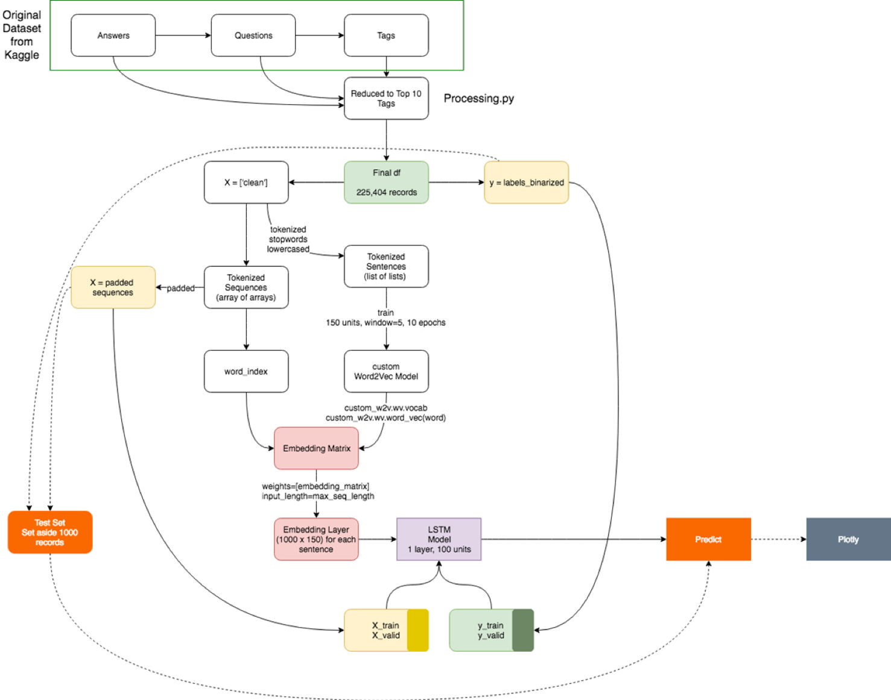

# multilabeltext
Tutorial from UVA DataPalooza 2018 Machine Learning Skills Session 

<h2>From Keras to Plotly: Building Deep Learning Models and Visualizing Predictions at UVA DataPalooza, November 9, 2018 Machine Learning Skills Session</h2>

In this tutorial you’ll be learning how to build a multi-label text classification model using data from Stack Overflow.  A multi-label problem differs from a multi-class problem, in that any sample can be assigned to multiple classes, as opposed to a standard binary classification problem where one sample is assigned to only specific class. In this tutorial you’ll learn what about the Word2Vec Skip Gram implementation and how to develop a word embedding layer for a Long Short-Term Memory (LSTM) recurrent neural network. The predictions we make will be used to visualize in Plotly.

We’ll embark on our Keras journey together using a Jupyter Notebook file loaded in the new Google Colaboratory environment that allows for 12 hours of free GPU run-time on a Tesla K80.  Since we don’t have a lot of time together, I’ve pre-run several of the models we’ll use ahead of time, so you can just load them up and run them during the tutorial.  I’ve also written a processing script that, for future use, you can modify for your customization.

For this session you don’t need anything more than your laptop and a Google account in order to access your Google Drive.  Everything you need is located on this publicly accessible Google Drive Folder. Since this is connected to my own personal drive, please do not share this link outside of the tutorial. It will be shut down after the tutorial is finished.  

NOTE ON THIS GITHUB REPO: 

First, you should run `processing.py` - a basic script that you can use to select how many top n labels you want to model. In order to do that, you need to download the original dataset from Kaggle: https://www.kaggle.com/stackoverflow/pythonquestions. 

I chose to build a multilabel text classifier for hte top 10 labels due to memory constraints on Google Colab. Note, the script selects the top 10 minus 'python'. FYI, 'labels_binarized.joblib' and 'mlb_classes' are the one-hot-encoded multilabel binarizer results for the Top 10 labels. 

Once you have the outputs from the processing script, you can load them into the notebook. The current notebook loads up a saved .h5 Keras LSTM model. Due to the size of the saved model, I didn't commit it to Git. As a result, just run the notebook and the model yourself. Next, the notebook indicates `data_for_w2v` which is a 2D array of tokenized sentences. Again, if you run `processing.py` it will output the data needed to custom train word2vec.  You can then run the notebook to run and save your word2vec model. 

